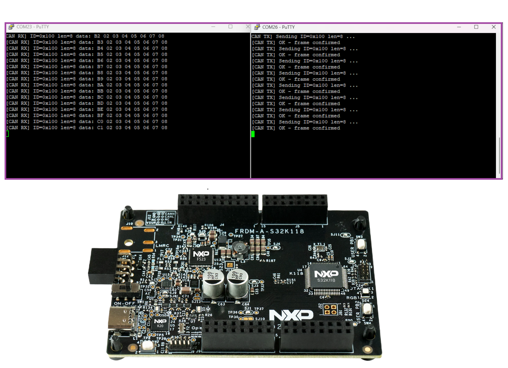
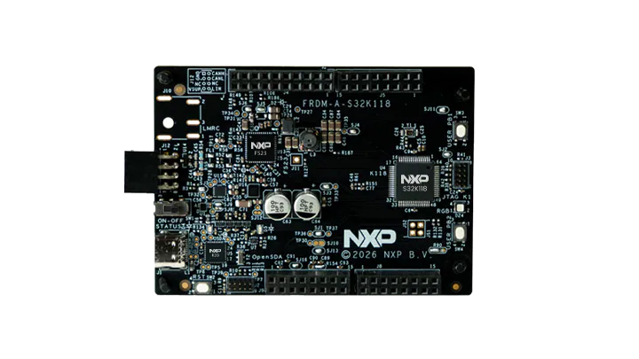

# NXP Application Code Hub
[](https://www.nxp.com)

##  Dual-Board Serial Communication with AUTOSAR CAN Driver

This example shows how to use the AUTOSAR CAN Driver on the FRDM-A-S32K118 to exchange CAN frames between two boards. One board sends frames periodically and the other receives them, with status reported on the LPUART console and signaled via the RGB LED.

[<p align="center"></p>](images/FRDM-A-S32K118_CAN.png)

#### Boards: FRDM-A-S32K118
#### Categories: Industrial
#### Peripherals: CAN, UART, GPIO
#### Toolchains: S32 Design Studio IDE

## Table of Contents
1. [Software and Tools](#step1)
2. [Hardware](#step2)
3. [Setup](#step3)
4. [Results](#step4)
5. [Support](#step5)
6. [Release Notes](#step6)


## 1. Software and Tools<a name="step1"></a>

### 1.1 S32K1 RTD Software Package
This example was developed using the S32K1 Real-Time Drivers (RTD) package for S32 Design Studio.
To download and install the complete software and tools ecosystem use the link below:
- [S32K1 RTD Software Package](https://www.nxp.com/app-autopackagemgr/automotive-software-package-manager:AUTO-SW-PACKAGE-MANAGER?currentTab=0&selectedDevices=S32K1)

### 1.2 S32 Design Studio IDE
- S32 Design Studio for S32 Platform 3.6.5 or later.

## 2. Hardware<a name="step2"></a>

### 2.1 Required Hardware
- 2x S32K118 evaluation boards
- 2x Micro-USB cables (power supply and debug)
- 1x CAN bus cable (twisted-pair wire for CAN_H / CAN_L or DB9 connector cable)
- [FRDM-A-S32K118](https://www.nxp.com/design/design-center/development-boards-and-designs/FRDM-A-S32K118)<p><p>

### 2.2 Hardware Connection
- Connect each board to the PC with a Micro-USB cable for power and debug.
- Connect the CAN_H and CAN_L lines between the two boards through the CAN bus connector.
- Ensure proper bus termination (120 ohm at each physical end) to avoid reflections.

## 3. Setup<a name="step3"></a>

### 3.1 Import the Project into S32 Design Studio IDE
1. Open S32 Design Studio IDE, in the Dashboard Panel, choose **Import project from Application Code Hub**.
[<p align="center"></p>](./images/import_project_1.png)

2. Search for the demo by name. Open the project, click the **GitHub** link from this window;
   S32 Design Studio IDE will automatically retrieve project attributes, then click **Next>**.
[<p align="center"></p>](./images/import_project_3.png)

3. Select the **main** branch and click **Next>**.
4. Choose your local path in **Destination -> Directory** and click **Next>**.
5. Select **Import existing Eclipse projects** then click **Next>**.
6. Select the project and click **Finish**.

### 3.2 Generating, Building and Running the Example
1. In Project Explorer, right-click the project and select **Update Code and Build Project**.
   This generates the RTD configuration (Pins, Clocks, Peripherals) and builds the project.
   Make sure the build completes and the `*.elf` is generated without errors.
[<p align="center"></p>](./images/update_and_build.png)
   Press **Yes** in the **SDK Component Management** pop-up window to continue.

2. Go to **Debug -> Debug Configurations**. A configuration is provided for this project:

        Configuration Name                  Description
        -------------------------------     -----------------------
        $(example)_debug_flash_pemicro      Debug the FLASH configuration using PEmicro probe

   Select the configuration and click **Debug** to start the debug session.
   Use the toolbar controls to run, pause, or step through the program.

3. Open a serial terminal (e.g. Tera Term or PuTTY) on the COM port of each board:
   - Baud rate: **115200**
   - Data bits: 8, Parity: None, Stop bits: 1, Flow control: None

4. Click **Resume (F8)** on both boards. The sender starts transmitting frames immediately.

### 3.3 Configuring the Board Role
Open `src/main.c` and locate the following line near the top of `main()`:

```c
boolean boardOne = FALSE;
```

| Value   | Board role | Behavior                                        |
|:-------:|:----------:|-------------------------------------------------|
| `TRUE`  | SENDER     | Sends one CAN frame (ID 0x100) every 500 ms     |
| `FALSE` | RECEIVER   | Waits for incoming frames and logs them via UART |

Flash one board with `boardOne = TRUE` (sender) and the other with `boardOne = FALSE` (receiver).


## 4. Results<a name="step4"></a>

Once both boards are powered and the CAN bus is connected, the following behavior is expected.

### 4.1 UART Console Output

**Sender board** — one block of messages is printed every 500 ms:

```
[INIT] CAN initialized and started
[INIT] Board role: SENDER
[CAN TX] Sending ID=0x100 len=8 ...
[CAN TX] OK - frame confirmed
[CAN TX] Sending ID=0x100 len=8 ...
[CAN TX] OK - frame confirmed
```

Each transmission attempt prints the frame header before the write call.
After the FlexCAN driver confirms the frame was placed on the bus,
`CanIf_TxConfirmation` fires and prints the confirmation line.

**Receiver board** — one block of messages is printed per received frame:

```
[INIT] CAN initialized and started
[INIT] Board role: RECEIVER
[CAN RX] ID=0x100 len=8 data: 00 02 03 04 05 06 07 08
[CAN RX] ID=0x100 len=8 data: 01 02 03 04 05 06 07 08
[CAN RX] ID=0x100 len=8 data: 02 02 03 04 05 06 07 08
```

`payload[0]` is a rolling counter (0x00, 0x01, 0x02 ...) that increments on every frame,
making it easy to spot lost frames. The remaining seven bytes are static
(`0x02 0x03 0x04 0x05 0x06 0x07 0x08`).

**Error condition** — if a transmission is not acknowledged within the polling timeout:

```
[CAN TX] TIMEOUT - no confirmation received
```

**Bus-Off event** — if the FlexCAN controller enters Bus-Off state:

```
[CAN ERR] Bus-Off detected on controller
```

### 4.2 RGB LED Behavior

| LED color | Event                                               |
|:---------:|-----------------------------------------------------|
| BLUE ON   | Sender: CAN frame write submitted, waiting for Tx confirmation |
| BLUE OFF  | Sender: `CanIf_TxConfirmation` received, frame is on the bus   |
| GREEN ON  | Receiver: new CAN frame received (`CanIf_RxIndication`)         |
| GREEN OFF | Receiver: 200 ms visual flash completed, LED cleared in main loop |
| RED ON    | Error: Tx polling timeout OR Bus-Off condition detected           |

### 4.3 Frame Format

| Field         | Value / Description                               |
|:-------------:|---------------------------------------------------|
| CAN ID        | 0x100 (11-bit standard identifier)                |
| DLC           | 8 bytes                                           |
| payload[0]    | Rolling sequence counter (increments every frame) |
| payload[1..7] | Static pattern: 0x02 0x03 0x04 0x05 0x06 0x07 0x08 |
| Tx period     | 500 ms                                            |
| Rx LED flash  | 200 ms                                            |

### 4.4 Diagnostic Variables in S32DS Debugger

The following module-level variables in `can_app.c` can be added as watch expressions in S32
Design Studio to monitor activity without additional instrumentation:

| Variable          | Type             | Description                                      |
|:-----------------:|:----------------:|--------------------------------------------------|
| `s_u8TxCount`     | `uint8` (static) | Number of successfully confirmed Tx frames       |
| `s_u8RxCount`     | `uint8` (static) | Number of frames received via `CanIf_RxIndication` |
| `s_bTxDone`       | `volatile boolean` (static) | Current Tx confirmation flag state     |
| `App_bNewRxFrame` | `volatile boolean` | Set by ISR callback; cleared by the main loop  |
| `App_RxCanId`     | `uint32`         | CAN ID of the last received frame                |
| `App_RxLength`    | `uint8`          | DLC of the last received frame                   |
| `App_RxData[8]`   | `uint8[]`        | Payload bytes of the last received frame         |

## 5. Support<a name="step5"></a>
For general technical questions related to NXP microcontrollers, please use the
*[NXP Community Forum](https://community.nxp.com/)*.

#### Project Metadata

<!----- Boards ----->
[](https://mcuxpresso.nxp.com/appcodehub?hwBoard=S32K118)

<!----- Categories ----->
[](https://mcuxpresso.nxp.com/appcodehub?category=industrial)

<!----- Peripherals ----->
[](https://mcuxpresso.nxp.com/appcodehub?peripheral=can)
[](https://mcuxpresso.nxp.com/appcodehub?peripheral=gpio)
[](https://mcuxpresso.nxp.com/appcodehub?peripheral=uart)

<!----- Toolchains ----->
[](https://mcuxpresso.nxp.com/appcodehub?toolchain=s32_design_studio_ide)

Questions regarding the content/correctness of this example can be entered as Issues within
this GitHub repository.

>**Note**: For more general technical questions regarding NXP Microcontrollers and the difference
> in expected functionality, enter your questions on the
> [NXP Community Forum](https://community.nxp.com/)

[](https://www.youtube.com/NXP_Semiconductors)
[](https://www.linkedin.com/company/nxp-semiconductors)
[](https://www.facebook.com/nxpsemi/)
[](https://x.com/NXP)

## 6. Release Notes<a name="step6"></a>
| Version | Description / Update                           | Date                              |
|:-------:|------------------------------------------------|----------------------------------:|
| 1.0     | Initial release on Application Code Hub        | September 21<sup>th</sup> 2026    |
